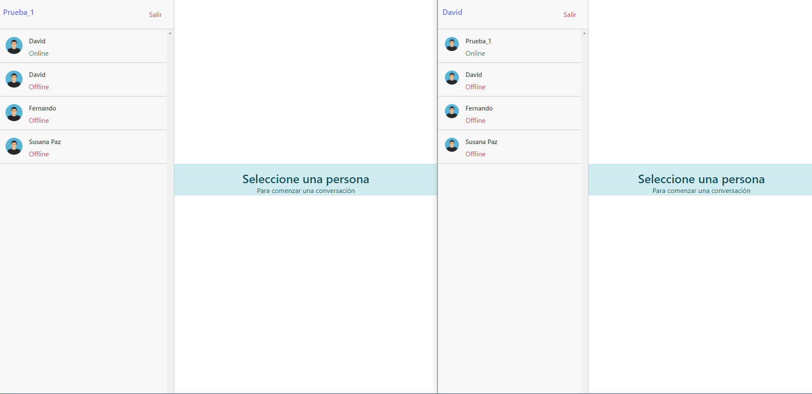

# Chat

Aplicación de chat creada con React. Emplea Socket para comunicación en tiempo real con el backend. Permite mensajes privados. 

Aplicación basada en el curso [React: Aplicaciones en tiempo real con Socket-io](https://udemy.com/course/react-socket-io-fernando)



# Para emprezar con este repositorio


## Ejecutar para desarrollo

crear el fichero .env.development con la siguiente información: 
```
REACT_APP_API_URL=
REACT_APP_SOCKET_URL=
```


Con las URLs en las que se encuentre el backend, tanto la API (para recuperar el historial de mensajes) como el del socket. 


En el directorio del proyecto ejecutar:

### `npm start`

Abrir [http://localhost:3000](http://localhost:3000) en el navegador.


